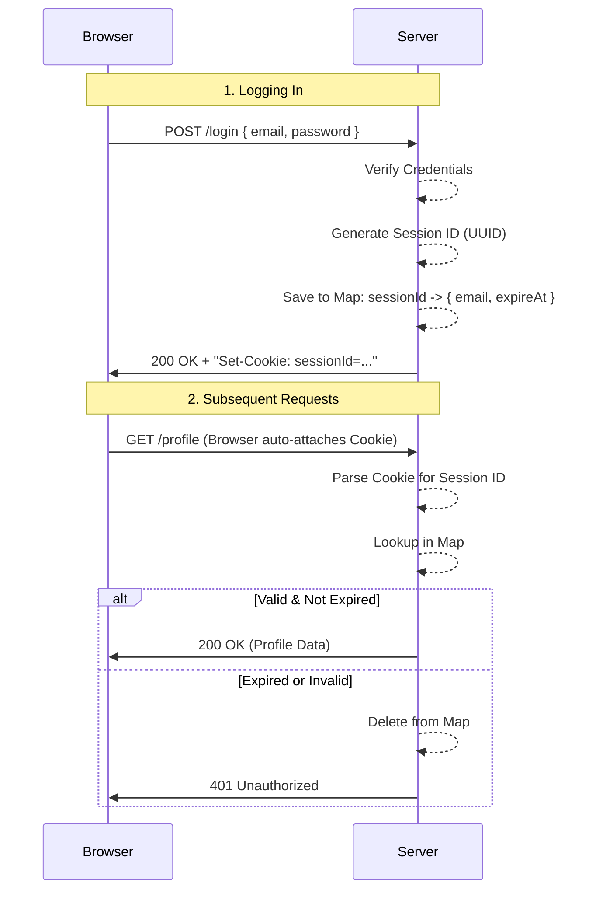

# Phase 2 — Sessions

## The Problem: HTTP is Forgetful

Imagine walking into a high-security building. At the front desk, you show your ID and prove who you are (Phase 1: Password Auth). They let you in. But when you walk to the elevator, the guard there asks for your ID again. Then the person at the office door asks for your ID again.

This is exactly how the web works. **HTTP is stateless**. Every request you make from the browser to the server is an isolated event. The server has no memory of the request you made one second ago. If you want to view a protected dashboard after logging in, you'd technically have to send your password with every single request.

This is tedious and insecure. Instead, we need a "wristband" — a temporary pass that proves you already showed your ID at the front desk.

This wristband is a **Session**.

---

## The Mental Model

1. **The User Authenticates:** The user provides their email and password. We verify them as we did in Phase 1.
2. **The Server Generates a Wristband (Session ID):** Instead of immediately closing the connection, the server generates a cryptographically secure, random string (e.g., a UUID).
3. **The Server Remembers the Wristband:** The server stores this Session ID in its own memory (a "Session Store"), alongside who it belongs to (the user's email) and when it expires.
4. **The Server Gives the Wristband to the Client:** The server sends the Session ID back to the browser, hidden inside a **Cookie**.
5. **The Client Shows the Wristband:** On every subsequent request, the browser automatically attaches this Cookie.
6. **The Server Verifies:** The server looks at the Cookie, checks its Session Store, and says, "Ah, wristband #12345 belongs to user@example.com, let them in."

---

## Architecture Overview



---

## Key Concepts Learned

### 1. The Session Store (Stateful Auth)

In `session-store.ts`, we maintain a simple in-memory `Map` tying Session IDs to User Data.

```typescript
const sessions = new Map<string, Session>();
```

**Trade-offs:** Fast and simple, but **stateful**. If the Node.js server crashes or restarts, all users are logged out because the `Map` is wiped. If we scaled to multiple servers, Server A wouldn't know about sessions created on Server B. In a real-world scenario, this in-memory Map is usually replaced by a fast, centralized store like Redis.

### 2. Why Cookies? (And why not LocalStorage?)

When the server sends the Session ID, the frontend needs to store it somewhere. We use **Cookies** instead of `localStorage` for critical security reasons:

```typescript
// cookie.ts
const COOKIE_OPTIONS = "HttpOnly; Path=/; SameSite=Strict";
```

- **`HttpOnly`**: This is the most crucial flag. It tells the browser, "Do not let JavaScript read this cookie." If an attacker manages to inject malicious JavaScript into our site (Cross-Site Scripting, or XSS), they can easily read `localStorage.getItem("sessionId")`. They **cannot** read an `HttpOnly` cookie.
- **`SameSite=Strict`**: This tells the browser to only send the cookie if the request originates from the same site. This is our first line of defense against Cross-Site Request Forgery (CSRF).
- **Automatic Attachment**: Browsers are built to handle cookies automatically. You don't need to write frontend code to manually inject the Session ID into every `fetch` request; the browser does the heavy lifting.

### 3. The CORS Reality Check

During Phase 2, we hit a classic web development wall: **Cross-Origin Resource Sharing (CORS)** and cookies.

Our frontend runs on `http://127.0.0.1:5500` (via Live Server) and our backend runs on `http://127.0.0.1:5000`. Because the ports are different, browsers consider these **different origins**.

By default, fetch requests to a different origin **will not send cookies**, and responses **cannot set cookies**.

To make the wristband system work across origins, we had to build a bridge:

**On the Frontend (`api.ts`):**
We had to tell fetch to explicitly include our credentials (cookies) in cross-origin requests.

```typescript
const response = await fetch(`${BASE_URL}${endpoint}`, {
   method: "POST",
   credentials: "include", // <-- Crucial for sending/receiving cookies across ports
   // ...
});
```

**On the Backend (`server.ts`):**
We had to configure CORS to explicitly allow this trusted relationship.

```typescript
res.setHeader("Access-Control-Allow-Origin", "http://127.0.0.1:5500"); // Cannot be "*"
res.setHeader("Access-Control-Allow-Credentials", "true"); // Explicit permission for cookies
```

_Note: If `Access-Control-Allow-Credentials` is true, the `Allow-Origin` cannot be the wildcard `_`. The browser demands you explicitly state exactly which origin is allowed to read this sensitive data.\*

### 4. Reading the Cookie (The Session Guard)

When a protected request comes in (like viewing the Dashboard at `/profile`), we check the wristband.

```typescript
// session-guard.ts
export function requireSession(req: IncomingMessage, res: ServerResponse) {
   // 1. Parse raw HTTP header: "sessionId=123-456; other=value" -> { sessionId: "123-456" }
   const cookies = parseCookies(req.headers.cookie);
   const sessionId = cookies.sessionId;

   if (!sessionId) {
      /* Reject */
   }

   // 2. Check the store
   const email = getSession(sessionId);

   if (!email) {
      /* Reject */
   }

   return { sessionId, email }; // Let them in
}
```

Wait, what does `getSession()` do under the hood?

```typescript
// session-store.ts
export function getSession(sessionId: string): string | undefined {
   const session = sessions.get(sessionId);
   // ...
   if (Date.now() > session.expireAt) {
      deleteSession(sessionId);
      return undefined; // The wristband expired!
   }
   return session.email;
}
```

This enforces **Absolute Expiration**. Five minutes after creation, the session dies. The user must log in again, regardless of whether they were actively using the site.

### 5. Logging Out

Logging out is simply destroying the wristband on both sides:

1. **Server-side:** Delete the Session ID from the `Map`.
2. **Client-side:** Send an identical `Set-Cookie` header but with an empty value and `Max-Age=0`, forcefully instructing the browser to delete the cookie immediately.

---

## Known Limitations

We now have persistent, stateful authentication! But remember that `SameSite=Strict` flag? That provides _some_ protection against CSRF, but what if a user is using an older browser, or what if our backend needs to support cross-site requests in the future? We need a more robust defense mechanism.

That brings us to **Phase 3: CSRF Protection**.
