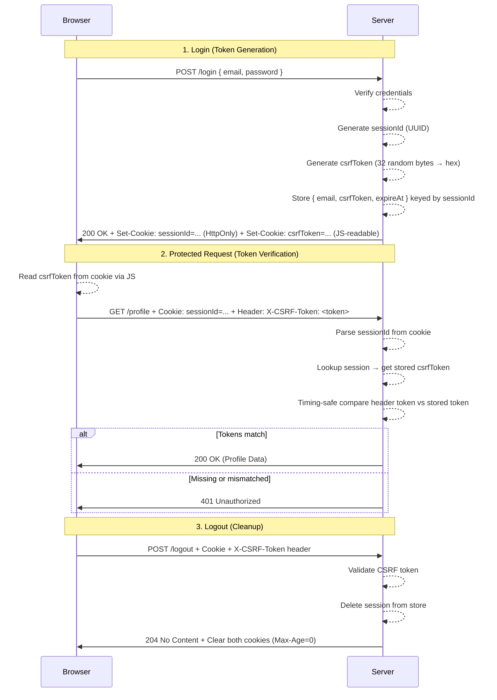

# Phase 3 — CSRF Protection

## The Problem: Your Browser Trusts Too Easily

Imagine you're logged into your bank at `bank.com`. In another tab, you visit a sketchy meme site. Hidden on that page is an invisible form:

```html
<form action="https://bank.com/transfer" method="POST">
   <input type="hidden" name="to" value="attacker" />
   <input type="hidden" name="amount" value="10000" />
</form>
<script>document.forms[0].submit();</script>
```

Your browser dutifully attaches your `bank.com` session cookie to that request — because cookies are sent automatically based on the **destination**, not the page you're on. The bank sees a valid session, processes the transfer, and you just got robbed.

This is **Cross-Site Request Forgery (CSRF)** — an attack where a malicious site tricks your browser into making authenticated requests on your behalf.

---

## Wait, Didn't `SameSite=Strict` Fix This?

In Phase 2 we set `SameSite=Strict` on our session cookie. This tells the browser: "Only attach this cookie if the request originates from the same site." That blocks the attack above in modern browsers.

So why add more protection?

1. **Defense in depth.** Security is about layers. If a browser has a bug, or a future feature relaxes SameSite behavior, a second line of defense catches the attack.
2. **SameSite isn't universal.** Older browsers don't support it. Some corporate environments use outdated software.
3. **It's the industry standard.** The Synchronizer Token Pattern we implement here is recommended by OWASP and used by virtually every production web framework.

---

## The Mental Model: A Secret Handshake

Think of it like this:

- **Session cookie** = your building access badge (proves identity)
- **CSRF token** = a secret handshake only you and the security guard know

An attacker can photocopy your badge (the browser sends the cookie automatically), but they don't know the handshake. Without both, the guard won't let the request through.

Here's how the handshake works:

1. **On login**, the server generates a random CSRF token and ties it to your session.
2. The server sends this token in a **non-HttpOnly cookie** (readable by JavaScript).
3. On every subsequent request, the frontend reads the token from the cookie and sends it back in a **custom HTTP header** (`X-CSRF-Token`).
4. The server compares the header value against the token stored in the session. If they match, the request is legitimate.

Why does this work? Because an attacker on `evil.com` **cannot read cookies from your domain** (Same-Origin Policy) and therefore **cannot set the custom header**. The browser sends the cookie automatically, but the header requires JavaScript running on your origin.

---

## Architecture Overview



---

## Key Concepts Learned

### 1. The Synchronizer Token Pattern

This is the classic CSRF defense recommended by OWASP. The idea: force the client to prove it can read a server-issued secret — something a cross-origin attacker cannot do.

```
Server generates token → stores in session + sends as cookie
Client reads cookie    → sends back as custom header
Server compares        → header value === stored value?
```

The critical insight: **cookies travel automatically, but custom headers require explicit JavaScript code running on the same origin.**

### 2. Two Cookies, Two Purposes

On login, the server now sets **two** cookies:

```typescript
// cookie.ts
const SESSION_COOKIE_OPTIONS = "HttpOnly; Path=/; SameSite=Strict";
const CSRF_COOKIE_OPTIONS    = "Path=/; SameSite=Strict";
```

| Cookie      | `HttpOnly` | Readable by JS | Purpose                                    |
| ----------- | ---------- | -------------- | ------------------------------------------ |
| `sessionId` | Yes        | No             | Proves identity (must be hidden from XSS)  |
| `csrfToken` | No         | Yes            | Proves the request came from our own origin |

Why isn't the CSRF cookie `HttpOnly`? Because the entire point is for our frontend JavaScript to **read** it and **echo** it back in a header. If JavaScript can't read it, the pattern doesn't work.

Why is this safe? An attacker on `evil.com` cannot read cookies belonging to `your-app.com` — that's the Same-Origin Policy. Only JavaScript running on your origin can read the `csrfToken` cookie.

### 3. Token Generation

```typescript
// auth-service.ts
const csrfToken = crypto.randomBytes(32).toString("hex");
createSession(sessionId, csrfToken, normalizedEmail);
```

- **32 random bytes** → 64-character hex string → 256 bits of entropy
- Generated using `crypto.randomBytes`, which pulls from the OS cryptographic random number generator
- Tied 1:1 to a session — each login produces a fresh, unique token

### 4. Storing the Token in the Session

```typescript
// session-store.ts
interface Session {
   email: string;
   csrfToken: string;
   expireAt: number;
}

const sessions = new Map<string, Session>();
```

The CSRF token lives inside the session object. This means:
- It shares the same lifetime as the session (5 minutes)
- It's cleaned up automatically when the session expires or the user logs out
- There's no separate storage mechanism to maintain

### 5. The Frontend: Reading and Sending the Token

```typescript
// api.ts (Frontend)
function getCsrfToken(): string | undefined {
   const match = document.cookie
      .split("; ")
      .find((row) => row.startsWith("csrfToken="));
   return match?.split("=")[1];
}
```

Before every protected request (`getRequest`, `postRequestNoBody`), the frontend:
1. Reads the `csrfToken` cookie via `document.cookie`
2. Attaches it as a custom header: `X-CSRF-Token`

```typescript
const csrfToken = getCsrfToken();
const headers: Record<string, string> = {};
if (csrfToken) {
   headers["X-CSRF-Token"] = csrfToken;
}
```

Note that `postRequest` (used for login/signup) does **not** send the CSRF header — you don't have a session yet at that point.

### 6. The Backend: Validating the Token

The `requireAuth` function in `session-guard.ts` is now the gatekeeper for all protected routes:

```typescript
// session-guard.ts
export function requireAuth(req: IncomingMessage, res: ServerResponse): SessionInfo | null {
   // Step 1: Is the X-CSRF-Token header present?
   const tokenFromHeader = req.headers["x-csrf-token"];
   if (typeof tokenFromHeader !== "string") {
      res.writeHead(401);
      res.end("Unauthorized");
      return null;
   }

   // Step 2: Is the session valid?
   const session = requireSession(req, res);
   if (!session) return null;

   // Step 3: Does the token match what's stored in the session?
   const isTokenValid = compareCsrfToken(session.sessionId, tokenFromHeader);
   if (!isTokenValid) {
      res.writeHead(401);
      res.end("Unauthorized");
      return null;
   }

   return session;
}
```

Three checks, in order: header exists → session is valid → token matches. Fail any one and the request is rejected with an identical `401 Unauthorized` (no hints about *which* check failed).

### 7. Timing-Safe Comparison (Again!)

```typescript
// csrf-token-verification.ts
export function compareCsrfToken(sessionId: string, tokenFromHeader: string): boolean {
   const storedCsrfToken = getCsrfToken(sessionId);
   if (!storedCsrfToken) return false;

   const a = Buffer.from(storedCsrfToken, "hex");
   const b = Buffer.from(tokenFromHeader, "hex");

   if (a.length !== b.length) return false;

   return crypto.timingSafeEqual(a, b);
}
```

Just like password verification in Phase 1, we use `crypto.timingSafeEqual`. A standard `===` comparison leaks information through timing — it returns `false` faster when the first byte doesn't match vs. the last byte. An attacker could theoretically guess the token one byte at a time. `timingSafeEqual` always takes the same amount of time regardless of where the mismatch occurs.

### 8. CORS: Allowing the Custom Header

When the frontend sends a custom header (`X-CSRF-Token`), the browser fires a **preflight OPTIONS request** to ask, "Is this header allowed?" The backend must explicitly permit it:

```typescript
// server.ts
res.setHeader("Access-Control-Allow-Headers", "Content-Type, X-CSRF-Token");
```

Without this, the browser blocks the request before it ever reaches the server.

### 9. Cleanup on Logout

Both cookies are cleared on logout:

```typescript
// auth-route.ts
res.setHeader("Set-Cookie", [clearSessionCookie(), clearCsrfCookie()]);
```

The session is deleted from the server-side store, and both cookies are expired on the client. No dangling tokens left behind.

---

## Request Flow

### Login (`POST /login`) — Token Issuance

```
1. Client sends { email, password }
2. Server verifies credentials (Phase 1 logic)
3. Server generates sessionId (UUID) + csrfToken (32 random bytes → hex)
4. Server stores { email, csrfToken, expireAt } in session Map
5. Server responds with two Set-Cookie headers:
   - sessionId=... ; HttpOnly; Path=/; SameSite=Strict
   - csrfToken=... ; Path=/; SameSite=Strict        ← JS-readable
6. Returns 200 "Login Successful"
```

### Protected Request (`GET /profile`) — Token Verification

```
1. Frontend reads csrfToken from document.cookie
2. Frontend sends GET /profile with:
   - Cookie: sessionId=... (automatic)
   - Header: X-CSRF-Token: <token> (explicit)
3. session-guard.ts → checks X-CSRF-Token header exists
4. session-guard.ts → parses sessionId from cookie, looks up session
5. csrf-token-verification.ts → timing-safe compares header token vs stored token
6. If all pass → returns profile data
7. If any fail → 401 Unauthorized
```

### Logout (`POST /logout`) — Token Cleanup

```
1. Frontend reads csrfToken, sends POST /logout with Cookie + X-CSRF-Token header
2. session-guard.ts → validates CSRF token (same 3-step check)
3. session-store.ts → deletes session from Map
4. Server clears both cookies (Max-Age=0)
5. Returns 204 No Content
```

---

## Security Measures Implemented

| Measure                          | Where                          | What It Prevents                         |
| -------------------------------- | ------------------------------ | ---------------------------------------- |
| Synchronizer Token Pattern       | Full stack                     | Cross-Site Request Forgery               |
| `crypto.randomBytes(32)`         | `auth-service.ts`              | Token prediction / brute-forcing         |
| `crypto.timingSafeEqual`         | `csrf-token-verification.ts`   | Timing attacks on token comparison       |
| HttpOnly session cookie          | `cookie.ts`                    | XSS stealing the session ID              |
| Non-HttpOnly CSRF cookie         | `cookie.ts`                    | Allows JS to read token for header echo  |
| `SameSite=Strict` on both        | `cookie.ts`                    | Cross-site cookie leakage                |
| CORS `Allow-Headers`             | `server.ts`                    | Browser blocking custom header           |
| Identical 401 for all failures   | `session-guard.ts`             | Information leakage about failure reason  |
| Token tied to session lifetime   | `session-store.ts`             | Stale tokens persisting after expiry     |

---

## File Reference

| File                                              | Phase 3 Role                                          |
| ------------------------------------------------- | ----------------------------------------------------- |
| `Backend/src/services/auth-service.ts`            | Generates CSRF token on login                         |
| `Backend/src/sessions/session-store.ts`           | Stores and retrieves CSRF token per session           |
| `Backend/src/sessions/session-guard.ts`           | `requireAuth` validates session + CSRF token          |
| `Backend/src/utils/csrf-token-verification.ts`    | Timing-safe CSRF token comparison                     |
| `Backend/src/utils/cookie.ts`                     | Builds/clears session and CSRF cookies                |
| `Backend/src/routers/auth-route.ts`               | Sets both cookies on login, clears both on logout     |
| `Backend/src/routers/profile-route.ts`            | Uses `requireAuth` (session + CSRF) for protection    |
| `Backend/src/server.ts`                           | CORS `Allow-Headers` includes `X-CSRF-Token`          |
| `Backend/src/types/auth-types.ts`                 | `ServiceResult` includes optional `csrfToken` field   |
| `Frontend/src/api.ts`                             | Reads CSRF cookie, sends `X-CSRF-Token` header        |

---

## Known Limitations (Addressed in Later Phases)

- **No token-based auth** — Sessions are stateful and server-bound. Can't scale horizontally without shared storage → Phase 4 (JWT)
- **No token refresh** — Sessions expire after 5 minutes with no renewal mechanism → Phase 5 (Refresh Tokens)
- **No multi-factor auth** — Password + CSRF token prevents forgery, but not credential theft → Phase 6 (MFA)
- **Single CSRF token per session** — The token doesn't rotate on each request. Per-request rotation adds complexity but further limits the window of a leaked token.
- **No Secure flag on cookies** — We're running over HTTP in development. In production, cookies should include `Secure` to prevent transmission over unencrypted connections.
