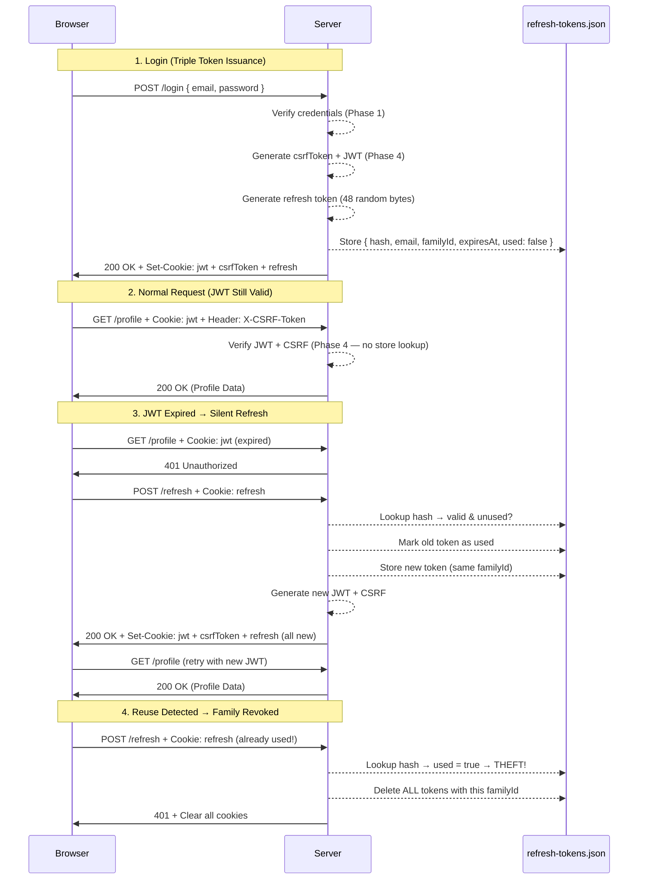

# Phase 5 — Refresh Tokens

## The Problem: The 5-Minute Wall

In Phase 4, we replaced stateful sessions with stateless JWTs. The server no longer remembers anything — it signs a token, hands it over, and verifies it on every request by re-computing the signature. Elegant, scalable, and completely stateless.

But we left a sharp edge exposed: **the JWT expires in 5 minutes, and there's no way to renew it.**

Imagine writing a long email in a web app. Five minutes in, you click "Send" — and get redirected to the login page. Your JWT expired silently, and your work is gone. You re-enter your password, but the damage is done. Do this a few times and your users stop trusting your product.

The naive fix is to make JWTs last longer — hours, maybe days. But that creates a worse problem: if a JWT is stolen (via XSS, network interception, or a compromised device), the attacker has a valid key to your account for the entire lifetime of the token. And since JWTs are stateless, the server has no "revoke" button. You just have to wait for it to expire.

We need a way to **keep JWTs short-lived** (limiting the damage window) while **keeping users logged in** (preserving the experience). The solution is a second token with a fundamentally different job.

That's a **Refresh Token**.

---

## The Mental Model: An Access Badge and a Key Card

Think of a corporate office with two levels of access:

- **Access badge** (the JWT) — Gets you through any door instantly. No guard checks a database; the badge itself is proof. But it expires at the end of each hour and turns off automatically. If someone steals it, it only works until the hour ends.

- **Key card** (the refresh token) — Doesn't open any doors by itself. Its only purpose is to go to the front desk and get a **new access badge**. The desk clerk checks the key card against a ledger, issues a fresh badge, and **takes the old key card**, handing you a new one. If someone tries to use a key card that's already been swapped, the clerk knows it was stolen — and deactivates all cards from that visit.

This is the **dual-token architecture**: a short-lived JWT for fast, stateless access, paired with a long-lived refresh token for silent renewal.

---

## The Two Tokens Compared

| Property              | Access Token (JWT)                     | Refresh Token                           |
| --------------------- | -------------------------------------- | --------------------------------------- |
| **Format**            | Signed JWT (header.payload.signature)  | Opaque random string (48 bytes → hex)   |
| **Lifetime**          | 5 minutes                              | 7 days                                  |
| **Stored (client)**   | `HttpOnly` cookie (`jwt`)              | `HttpOnly` cookie (`refresh`)           |
| **Stored (server)**   | Nothing (stateless)                    | SHA-256 hash in `refresh-tokens.json`   |
| **Used for**          | Authenticating every API request       | Getting a new JWT when the old one expires |
| **Sent to**           | All protected endpoints                | Only `POST /refresh`                    |
| **Stateless?**        | Yes                                    | No — requires a server-side lookup      |

The refresh token deliberately reintroduces a small amount of server-side state. This is the trade-off: we accept a lookup on the infrequent `/refresh` call in exchange for the ability to revoke tokens and detect theft — capabilities that pure stateless JWT cannot offer.

---

## Architecture Overview



---

## Key Concepts Learned

### 1. Why Not Just Make the JWT Last Longer?

This is the most common question, and the answer is about **blast radius**.

| JWT Lifetime | User Experience          | If Token Is Stolen...                       |
| ------------ | ------------------------ | ------------------------------------------- |
| 5 minutes    | Annoying (frequent login)| Attacker has 5 minutes of access            |
| 1 hour       | Tolerable                | Attacker has 1 hour of access               |
| 7 days       | Great                    | Attacker has 7 days of access               |

With long JWTs, the experience is smooth, but a stolen token is a disaster — and you can't revoke it (the server has no state). Refresh tokens give you the best of both:

- **Short JWT** → Small blast radius if stolen.
- **Long refresh token** → Smooth UX because the JWT is silently renewed.
- **Refresh token rotation** → If the refresh token is stolen, you can detect and revoke it.

### 2. Refresh Token Anatomy

Unlike JWTs, refresh tokens are **opaque** — they carry no information. They're just 48 random bytes:

```typescript
// refresh-token-service.ts
const raw = crypto.randomBytes(48).toString("hex");  // 96-char hex string
```

The server stores metadata about the token separately:

```typescript
interface StoredRefreshToken {
   tokenHash: string;    // SHA-256 hash of the raw token
   email: string;        // Who this token belongs to
   familyId: string;     // Groups all rotations from one login
   expiresAt: number;    // Unix timestamp (7 days from creation)
   used: boolean;        // Has this token been consumed by a rotation?
}
```

Why opaque and not another JWT? Because the refresh token's purpose is **revocability**. It must be checked against server-side state. There's no benefit to making it self-contained — it always requires a lookup.

### 3. Token Hashing — Don't Store What You Don't Need

```typescript
function hashToken(raw: string): string {
   return crypto.createHash("sha256").update(raw).digest("hex");
}
```

The raw refresh token is never stored. Only its SHA-256 hash is written to `refresh-tokens.json`. This is the same principle as password hashing (Phase 1), but with a key difference:

- **Passwords** use slow hashing (PBKDF2, 600K iterations) because they have low entropy (humans pick predictable passwords).
- **Refresh tokens** use fast hashing (single SHA-256) because they have **high entropy** (48 random bytes = 384 bits). Brute-forcing 384 bits of randomness is astronomically impractical regardless of hash speed.

If the database is compromised, the attacker gets hashes they can't reverse into usable tokens.

### 4. Token Families and Rotation

This is the core security mechanism. Every login starts a **token family** — a lineage of refresh tokens linked by a shared `familyId`:

```
Login → Token A (familyId: "abc-123", used: false)
                ↓ POST /refresh
        Token A (used: true) → Token B (familyId: "abc-123", used: false)
                                        ↓ POST /refresh
                                Token B (used: true) → Token C (familyId: "abc-123", used: false)
```

Each refresh:
1. Marks the current token as `used: true`.
2. Creates a new token with the **same `familyId`**.
3. Returns the new token to the client.

The old token is never deleted — it's kept as evidence. Here's why:

### 5. Reuse Detection — Catching Token Theft

This is where the family concept pays off. Imagine this scenario:

```
1. User logs in → gets Token A
2. Attacker steals Token A
3. Attacker uses Token A to refresh → gets Token B (Token A marked as used)
4. User's browser (still holding Token A) tries to refresh
5. Server sees Token A is already used → THEFT DETECTED
6. Server deletes ALL tokens with familyId "abc-123"
7. Both attacker (Token B) and user are logged out
```

```typescript
// refresh-token-service.ts — rotateRefreshToken
if (entry.used) {
   // Reuse detected: someone is replaying a consumed token.
   tokens = tokens.filter((t) => t.familyId !== entry.familyId);
   await writeToken(tokens);
   return null;
}
```

Yes, the legitimate user is also logged out. This is a deliberate security choice: **when theft is detected, nuke everything**. It's better to inconvenience one user (who just re-logs in) than to let an attacker maintain access.

The alternative — only revoking the reused token — would leave the attacker's newer token valid. That defeats the purpose entirely.

### 6. The Refresh Endpoint

```typescript
// refresh-route.ts
export async function handleRefresh(req: IncomingMessage, res: ServerResponse) {
   const cookies = parseCookies(req.headers.cookie);
   const refreshToken = cookies.refresh;

   if (!refreshToken) {
      res.writeHead(401);
      res.end("Unauthorized");
      return;
   }

   const result = await rotateRefreshToken(refreshToken);

   if (!result) {
      // Rotation failed (token not found, expired, or reuse detected)
      // Clear everything — force re-login
      res.setHeader("Set-Cookie", [clearJwtCookie(), clearCsrfCookie(), clearRefreshCookie()]);
      res.writeHead(401);
      res.end("Unauthorized");
      return;
   }

   // Issue a complete new set of tokens
   const csrfToken = crypto.randomBytes(32).toString("hex");
   const jwt = createToken(result.email, csrfToken);

   res.setHeader("Set-Cookie", [
      buildJwtCookie(jwt),
      buildCsrfCookie(csrfToken),
      buildRefreshCookie(result.newtoken),
   ]);
   res.writeHead(200);
   res.end("Token refreshed");
}
```

Notice what happens on success: **all three tokens are replaced**. The JWT, the CSRF token, and the refresh token are all freshly generated. This ensures:
- The new JWT has a fresh 5-minute window.
- The CSRF token rotates with each refresh cycle.
- The old refresh token is consumed and can't be reused.

On failure, **all three cookies are cleared**. Whether the token was missing, expired, or detected as reused, the response is the same: force the user back to login. No hints about what went wrong.

### 7. The Three Cookies

Login now sets three cookies, each with a distinct security profile:

```typescript
// cookie.ts
const JWT_COOKIE_OPTIONS     = "HttpOnly; Path=/; SameSite=Strict";
const CSRF_COOKIE_OPTIONS    = "Path=/; SameSite=Strict";
const REFRESH_COOKIE_OPTIONS = "HttpOnly; Path=/; SameSite=Strict; Max-Age=604800";
```

| Cookie    | `HttpOnly` | `Max-Age`      | JS-readable | Purpose                          |
| --------- | ---------- | -------------- | ----------- | -------------------------------- |
| `jwt`     | Yes        | Session (none) | No          | Authenticate every request       |
| `csrfToken`| No        | Session (none) | Yes         | CSRF double-submit pattern       |
| `refresh` | Yes        | 604800 (7 days)| No          | Silent JWT renewal               |

Why does the refresh cookie have an explicit `Max-Age` while the others don't?

- **JWT and CSRF** are session cookies (no `Max-Age`). They vanish when the browser closes. This is fine — the refresh token persists and can issue new ones on the next visit.
- **Refresh token** has a 7-day `Max-Age` so it survives browser restarts. This is what keeps users "logged in" across sessions.

### 8. Frontend: Silent Refresh with Retry

The frontend doesn't know or care when the JWT expires. It just makes requests. If a 401 comes back, it transparently attempts a refresh:

```typescript
// api.ts — getRequest (same pattern in postRequestNoBody)
response = await doFetch();
if (response.status === 401) {
   const refreshed = await refreshOnce();
   if (refreshed) {
      response = await doFetch();  // Retry with the new JWT
   }
}
```

The flow: **try → 401 → refresh → retry**. If the refresh fails too, the 401 propagates to the caller, and the dashboard redirects to login.

### 9. Refresh Deduplication

What if the JWT expires and three API calls fire simultaneously? Without protection, you'd get three concurrent refresh requests — and since each refresh consumes the token, the second and third would trigger reuse detection and nuke the family.

The solution is a simple promise-based singleton:

```typescript
// api.ts
let refreshPromise: Promise<boolean> | null = null;

function refreshOnce(): Promise<boolean> {
   if (!refreshPromise) {
      refreshPromise = attemptTokenRefresh().finally(() => {
         refreshPromise = null;
      });
   }
   return refreshPromise;
}
```

The first call creates the refresh promise. The second and third calls see it already exists and **attach to the same promise**. Once it resolves, the slot is cleared for future refreshes. This guarantees exactly one refresh request per expiration event.

### 10. Logout Now Revokes the Family

In Phase 4, logout was purely client-side — just clear the cookies. Now logout has a server-side component:

```typescript
// auth-route.ts
export async function handleLogout(req: IncomingMessage, res: ServerResponse) {
   const auth = requireAuth(req, res);
   if (auth === null) return;

   const cookies = parseCookies(req.headers.cookie);
   const refreshToken = cookies.refresh;
   if (refreshToken) {
      await revokeRefreshTokenFamily(refreshToken);
   }

   res.setHeader("Set-Cookie", [clearJwtCookie(), clearCsrfCookie(), clearRefreshCookie()]);
   res.writeHead(204);
   res.end();
}
```

```typescript
// refresh-token-service.ts
export async function revokeRefreshTokenFamily(raw: string): Promise<void> {
   const hash = hashToken(raw);
   const tokens = await readToken();
   const entry = tokens.find((t) => t.tokenHash === hash);
   if (!entry) return;

   const remaining = tokens.filter((t) => t.familyId !== entry.familyId);
   await writeToken(remaining);
}
```

Logout doesn't just delete the current refresh token — it deletes **every token in the family**. This means if an attacker stole an earlier token from this login session, it's now useless too.

### 11. Automatic Expiry Purging

Every read from the token store passes through a cleanup filter:

```typescript
function purgeExpired(tokens: StoredRefreshToken[]): StoredRefreshToken[] {
   const now = Math.floor(Date.now() / 1000);
   return tokens.filter((t) => t.expiresAt > now);
}
```

This runs on every `createRefreshToken` and `rotateRefreshToken` call, silently removing expired tokens. Without this, the `refresh-tokens.json` file would grow indefinitely with dead entries.

---

## What Changed from Phase 4

| Component                          | Phase 4 (JWT Only)                         | Phase 5 (+ Refresh Tokens)                           |
| ---------------------------------- | ------------------------------------------ | ---------------------------------------------------- |
| **Tokens issued on login**         | JWT + CSRF token                           | JWT + CSRF token + refresh token                     |
| **Cookies set on login**           | `jwt` + `csrfToken` (2 cookies)            | `jwt` + `csrfToken` + `refresh` (3 cookies)          |
| **Server-side state**              | None (fully stateless)                     | `refresh-tokens.json` (hashed tokens)                |
| **Token renewal**                  | Not possible — re-login required           | Silent refresh via `POST /refresh`                   |
| **Token revocation**               | Not possible — wait for expiry             | Revoke entire family on logout or reuse detection    |
| **Theft detection**                | None                                       | Reuse detection → family-wide revocation             |
| **Logout behavior**                | Clear cookies only                         | Revoke family + clear cookies                        |
| **Frontend request pattern**       | Fire and forget                            | Try → 401 → refresh → retry                         |
| **Concurrent 401 handling**        | N/A                                        | Deduplicated via `refreshOnce()` singleton           |

**Files added:**
- `Backend/src/services/refresh-token-service.ts` — Token creation, rotation, reuse detection, revocation
- `Backend/src/routers/refresh-route.ts` — `POST /refresh` endpoint handler
- `Backend/db/refresh-tokens.json` — File-based refresh token store

**Files modified:**
- `Backend/src/services/auth-service.ts` — Creates refresh token on login
- `Backend/src/routers/auth-route.ts` — Sets 3 cookies on login, revokes family on logout
- `Backend/src/utils/cookie.ts` — Added `buildRefreshCookie`, `clearRefreshCookie`
- `Backend/src/types/auth-types.ts` — `ServiceResult` includes optional `refreshToken`
- `Backend/src/server.ts` — Added `/refresh` route
- `Frontend/src/api.ts` — Added retry-on-401, `refreshOnce()` deduplication

---

## Request Flow

### Login (`POST /login`) — Triple Token Issuance

```
1. Client sends { email, password }
2. Server verifies credentials (Phase 1 logic)
3. Server generates csrfToken (32 random bytes → hex)
4. Server creates JWT { sub: email, csrf: csrfToken, exp: now + 300 }
5. Server generates refresh token (48 random bytes → hex)
6. Server stores SHA-256(refresh token) + { email, familyId, expiresAt, used: false }
7. Server responds with three Set-Cookie headers:
   - jwt=<signed-token>    ; HttpOnly; Path=/; SameSite=Strict
   - csrfToken=<token>     ; Path=/; SameSite=Strict
   - refresh=<raw-token>   ; HttpOnly; Path=/; SameSite=Strict; Max-Age=604800
8. Returns 200 "Login Successful"
```

### Silent Refresh (`POST /refresh`) — Token Rotation

```
1. Frontend detects 401 on a protected request
2. Frontend calls POST /refresh (browser sends refresh cookie automatically)
3. Server parses refresh token from cookie
4. Server computes SHA-256 hash, looks up in refresh-tokens.json
5. If not found or expired → 401 + clear all cookies
6. If found and used = true → REUSE DETECTED:
   - Delete ALL tokens with same familyId
   - 401 + clear all cookies
7. If found and used = false → VALID:
   - Mark current token as used = true
   - Generate new refresh token (same familyId)
   - Generate new JWT + CSRF token
   - Set all three cookies with new values
   - 200 "Token refreshed"
8. Frontend retries the original request with new JWT
```

### Logout (`POST /logout`) — Family Revocation

```
1. Frontend sends POST /logout with Cookie: jwt + refresh + Header: X-CSRF-Token
2. session-guard.ts → verifies JWT + CSRF (Phase 4 checks)
3. Server reads refresh token from cookie
4. Server finds the token's familyId, deletes ALL tokens in that family
5. Server clears all three cookies (Max-Age=0)
6. Returns 204 No Content
```

---

## Security Measures Implemented

| Measure                              | Where                          | What It Prevents                                |
| ------------------------------------ | ------------------------------ | ----------------------------------------------- |
| SHA-256 token hashing                | `refresh-token-service.ts`     | Database breach exposing usable tokens          |
| Token family grouping                | `refresh-token-service.ts`     | Enables family-wide revocation                  |
| Reuse detection                      | `refresh-token-service.ts`     | Stolen token replay attacks                     |
| Family revocation on reuse           | `refresh-token-service.ts`     | Attacker retaining access after detection       |
| Family revocation on logout          | `auth-route.ts`                | Lingering tokens after explicit logout          |
| Automatic expiry purging             | `refresh-token-service.ts`     | Unbounded storage growth                        |
| `HttpOnly` refresh cookie            | `cookie.ts`                    | XSS stealing the refresh token                  |
| `SameSite=Strict` on all cookies     | `cookie.ts`                    | Cross-site cookie leakage                       |
| 7-day `Max-Age` on refresh cookie    | `cookie.ts`                    | Indefinite token persistence                    |
| Clear all cookies on refresh failure | `refresh-route.ts`             | Stale cookies after revocation                  |
| Frontend refresh deduplication       | `api.ts`                       | Concurrent refreshes triggering reuse detection |
| Retry-on-401 pattern                 | `api.ts`                       | Users seeing auth errors during normal use      |
| 384-bit random token                 | `refresh-token-service.ts`     | Token guessing / brute-force                    |

---

## File Reference

| File                                              | Phase 5 Role                                              |
| ------------------------------------------------- | --------------------------------------------------------- |
| `Backend/src/services/refresh-token-service.ts`   | Token creation, rotation, reuse detection, family revocation |
| `Backend/src/routers/refresh-route.ts`            | `POST /refresh` — validates and rotates refresh token     |
| `Backend/db/refresh-tokens.json`                  | File-based storage for hashed refresh tokens              |
| `Backend/src/services/auth-service.ts`            | Creates refresh token on login alongside JWT              |
| `Backend/src/routers/auth-route.ts`               | Sets 3 cookies on login, revokes family on logout         |
| `Backend/src/utils/cookie.ts`                     | Builds/clears refresh cookie (HttpOnly, 7-day Max-Age)   |
| `Backend/src/types/auth-types.ts`                 | `ServiceResult` includes optional `refreshToken` field    |
| `Backend/src/server.ts`                           | Routes `/refresh` to handler                              |
| `Frontend/src/api.ts`                             | Silent refresh, retry-on-401, refresh deduplication       |

---

## Known Limitations (Addressed in Later Phases)

- **No multi-factor auth** — Credential theft still gives full access. A stolen password is a stolen account. → Phase 6 (MFA)
- **No `Secure` flag on cookies** — We're running over HTTP in development. In production, all three cookies must include `Secure` to prevent transmission over unencrypted connections.
- **File-based token store** — `refresh-tokens.json` has race conditions under concurrent writes. A real database (or Redis) with atomic operations would solve this.
- **No sliding window on refresh tokens** — The 7-day expiry is absolute from the time of the last rotation. An alternative approach is sliding expiry, where each successful rotation extends the window. This improves UX but widens the attack surface for long-lived sessions.
- **Secret key still regenerated on restart** — Existing JWTs are invalidated when the server restarts (Phase 4 limitation). The refresh tokens survive (stored in a file), but the first request after restart will trigger a refresh cycle.
