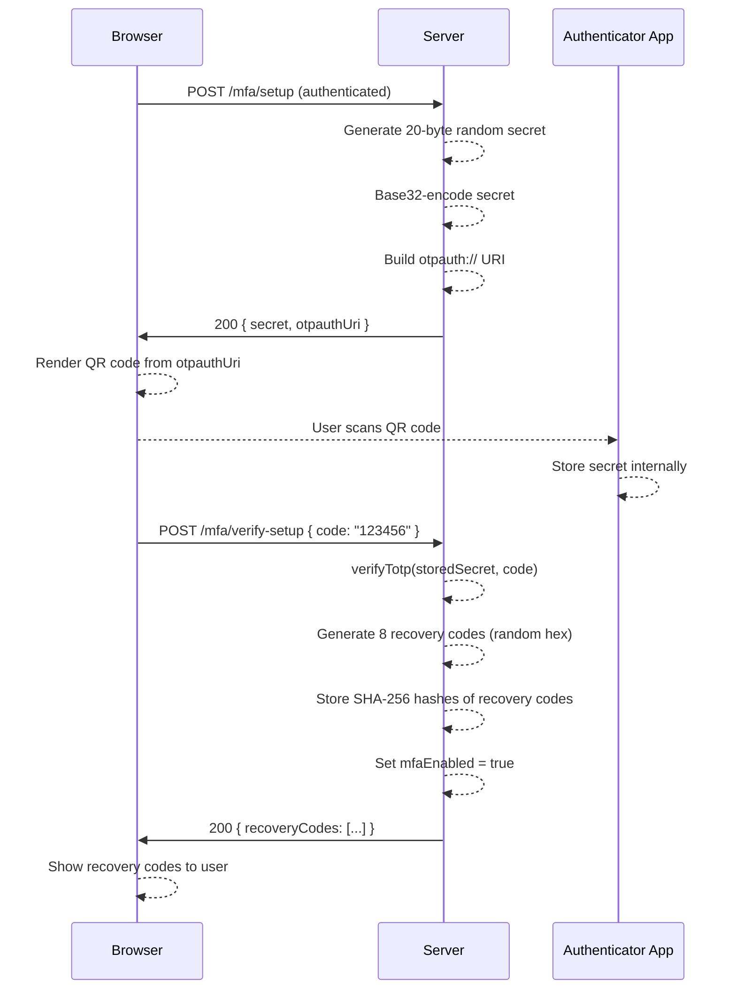
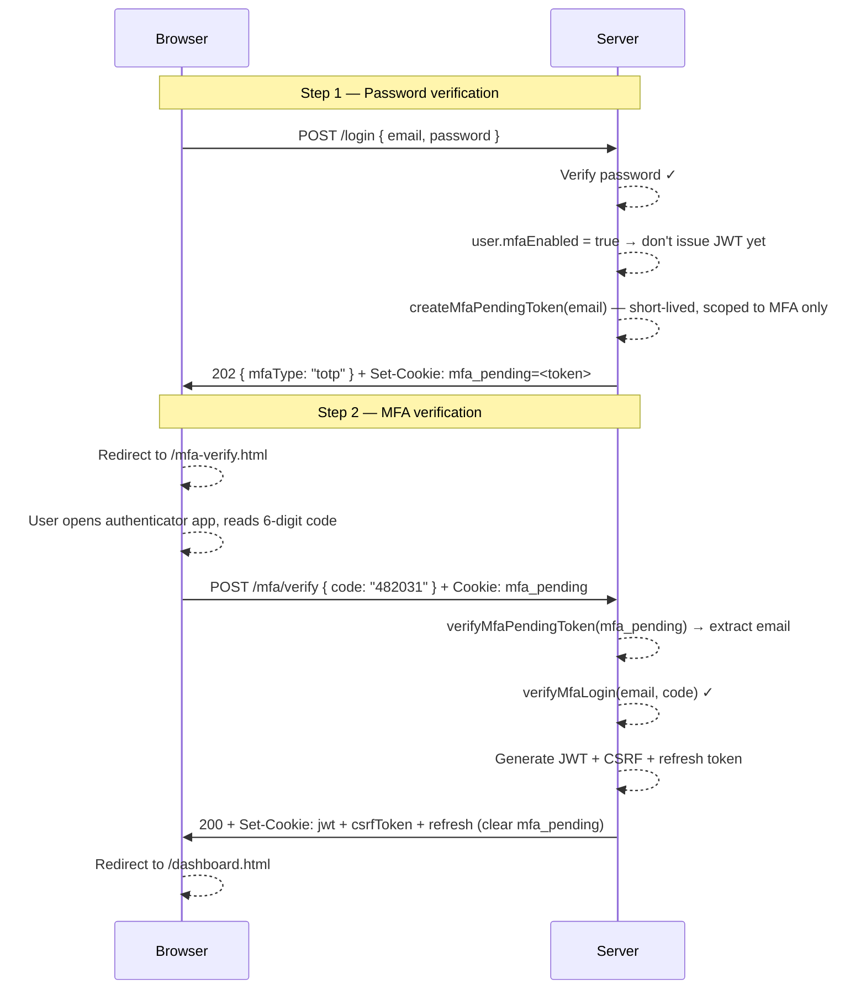
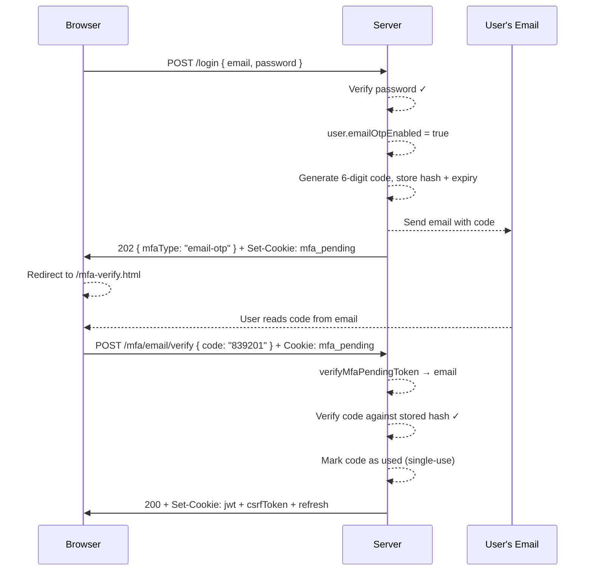
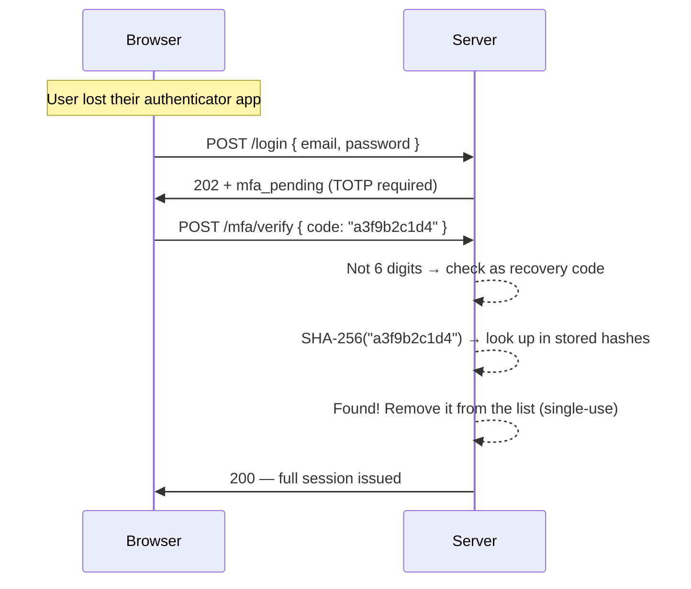

# Phase 6 — Multi-Factor Authentication (MFA)

## The Problem: One Lock on the Front Door

In Phase 5, we built a robust token system. Passwords are hashed, JWTs are short-lived, refresh tokens rotate on use, and theft is detected automatically. From a session management standpoint, we're in good shape.

But all of that only protects the *session* — it doesn't protect the *credential*.

If an attacker gets your password, they walk straight through every door we've built. And passwords get compromised all the time:

- **Phishing** — A fake login page tricks you into typing your real password.
- **Data breaches** — Another site you use gets hacked and leaks its user database. Because people reuse passwords, your account here is now vulnerable too.
- **Credential stuffing** — Attackers buy leaked username/password lists and automatically try them on thousands of sites. Automated, cheap, and surprisingly effective.

Once the attacker has the password, Phase 5's refresh token rotation doesn't help — they're logging in legitimately as far as the server is concerned. They get a real JWT, a real refresh token, and a real session.

The solution isn't a better password — it's a **second factor**.

---

## The Mental Model: The Two-Door Bank Vault

Picture a high-security bank vault with two separate doors, each requiring a different type of key:

- **Door 1** (password) — A combination you *know*. "What's the 8-digit code?"
- **Door 2** (MFA) — A key card you *have*. The card prints a new number every 30 seconds. "What does your card show right now?"

To open the vault, you need **both**. Knowing the combination doesn't help you if you don't have the card. Stealing the card doesn't help you if you don't know the combination.

This is the foundation of MFA: **something you know** + **something you have**. Even if one factor is compromised, the attacker is stuck at the second door.

The key insight is that the second factor is **time-bound**. The code on your key card changes every 30 seconds and can only be used once. A code stolen yesterday is worthless today.

---

## Two Flavors of MFA

We built two types of second factor, both generating short-lived codes:

| Type | Delivery | Code lifetime | Requires |
|------|----------|---------------|---------|
| **TOTP** (Time-based OTP) | Authenticator app | 30 seconds | App installed on your phone |
| **Email OTP** | Email inbox | Minutes (single use) | Access to your email account |

They share the same concept — a short-lived numeric code proves possession of something — but differ in how the code is delivered and how it's generated.

TOTP is stronger: the code is generated entirely on-device from a shared secret, with no network involved. Email OTP depends on the security of your email account.

---

## TOTP Theory — How a 6-Digit Code Proves You Have the Secret

This is the most cryptographically interesting part of Phase 6. Let's build up the math from scratch.

### Step 1: HMAC — A Fingerprint That Requires a Key

In Phase 4, we used HMAC-SHA256 to sign JWTs. HMAC stands for **Hash-based Message Authentication Code**. Given a secret key and a message, it produces a fixed-length fingerprint:

```
HMAC-SHA1(key, message) → 20 bytes
```

The crucial property: you can only produce this fingerprint if you have the key. Anyone with just the fingerprint cannot reverse-engineer the key.

### Step 2: HOTP — One-Time Codes From a Counter (RFC 4226)

**HOTP** (HMAC-based One-Time Password) turns HMAC into a sequence of 6-digit codes. The idea: both the server and your phone share the same secret key and a counter that starts at 0. To get code #1, both compute:

```
HOTP(secret, counter=1) → 6 digits
```

They'll always agree because they have the same inputs. After using a code, both increment the counter. This works — but it has a problem: if the counter drifts (your phone generates a code but doesn't use it), they fall out of sync.

### Step 3: TOTP — Replace the Counter With Time (RFC 6238)

**TOTP** (Time-based One-Time Password) solves the sync problem by replacing the counter with the current time, divided into 30-second buckets called **time steps**:

```
time_step = floor(current_unix_time / 30)
TOTP(secret) = HOTP(secret, time_step)
```

At any given moment, both the server and your authenticator app compute the exact same `time_step`. They generate the same code without ever communicating. No counter to sync — just synchronized clocks.

At `2026-06-19 10:00:00 UTC`, `unix_time = 1750327200`:
```
time_step = floor(1750327200 / 30) = 58344240
```
Both sides compute `HOTP(secret, 58344240)` and get the same 6 digits. 30 seconds later, the step increments and a completely new code is generated.

### Step 4: Dynamic Truncation — Turning 20 Bytes Into 6 Digits

`HMAC-SHA1` produces 20 bytes. How do we turn that into a clean 6-digit number?

RFC 4226 specifies a process called **dynamic truncation**:

```typescript
// totp-service.ts — generateHotp()
const hmac = crypto.createHmac("sha1", secret).update(counterBuffer).digest();

// 1. Use the last byte's low 4 bits as an offset (0-15)
const offset = hmac[hmac.length - 1] & 0x0f;

// 2. Read 4 bytes starting at that offset, clear the sign bit
const code =
   ((hmac[offset]     & 0x7f) << 24) |
   ((hmac[offset + 1] & 0xff) << 16) |
   ((hmac[offset + 2] & 0xff) << 8)  |
   ((hmac[offset + 3] & 0xff));

// 3. Take modulo 10^6 and pad to 6 digits
return (code % 10 ** 6).toString().padStart(6, "0");
```

Why these specific steps? They're standardized so every TOTP implementation — your authenticator app, our server, Google's servers — produces the same output from the same input.

The `& 0x7f` on the first byte clears the sign bit, ensuring we always get a positive integer regardless of platform.

### Step 5: Base32 — The Encoding Authenticator Apps Use

The shared secret is 20 random bytes. But when you scan a QR code with Google Authenticator or Authy, the secret has to be encoded as text. Why not Base64, like JWTs?

Base32 uses only characters `A-Z` and `2-7` — **32 characters total**. This matters because:
- No uppercase/lowercase confusion (Base64 has `A` and `a`, which look alike in some fonts)
- No characters that look like numbers (`0` vs `O`, `1` vs `l`)
- Can be typed manually without errors — important for the backup "enter key manually" flow

```typescript
// totp-service.ts
const BASE32_ALPHABET = "ABCDEFGHIJKLMNOPQRSTUVWXYZ234567";

export function base32Encode(buffer: Buffer): string {
   let bits = "";
   for (const byte of buffer) {
      bits += byte.toString(2).padStart(8, "0");  // Convert bytes → binary string
   }
   while (bits.length % 5 !== 0) bits += "0";     // Pad to multiple of 5

   let result = "";
   for (let i = 0; i < bits.length; i += 5) {
      const index = parseInt(bits.slice(i, i + 5), 2); // Take 5 bits → 0-31
      result += BASE32_ALPHABET[index];                 // Map to letter
   }
   return result;
}
```

The math: 8 bits per byte, 5 bits per Base32 character. Every 5 bytes (40 bits) becomes 8 Base32 characters. Our 20-byte secret becomes a 32-character string like `JBSWY3DPEHPK3PXP`.

### Step 6: The otpauth:// URI — How QR Codes Talk to Authenticator Apps

When you see a QR code during TOTP setup, it encodes a standardized URI:

```
otpauth://totp/AuthFromScratch:user@example.com?secret=JBSWY3DP...&issuer=AuthFromScratch&algorithm=SHA1&digits=6&period=30
```

This is the `otpauth://` scheme. The authenticator app reads it, extracts the `secret`, and stores it. From that point on, the app can generate codes entirely offline. It never needs to contact our server again — it just needs the secret and a clock.

```typescript
// totp-service.ts
export function buildOtpauthUri(email: string, secretBase32: string): string {
   const issuer = "AuthFromScratch";
   return `otpauth://totp/${encodeURIComponent(issuer)}:${encodeURIComponent(email)}?secret=${secretBase32}&issuer=${encodeURIComponent(issuer)}&algorithm=SHA1&digits=6&period=30`;
}
```

### Step 7: Clock Drift Tolerance — Why ±1 Step Exists

TOTP relies on both sides having the same time. But clocks drift. A phone that's 10 seconds behind will generate a code from a slightly different time step than the server expects.

We handle this by accepting codes from the **current step ± 1**:

```typescript
// totp-service.ts — verifyTotp()
const currentStep = Math.floor(Date.now() / 1000 / 30);

for (let i = -1; i <= 1; i++) {
   const expected = generateHotp(secret, currentStep + i);
   if (timingSafeCompare(expected, code)) return true;
}
```

This means at any moment, **3 codes are simultaneously valid**: the previous 30-second window, the current one, and the next one — covering a 90-second total window. This tolerates clocks that are up to 30 seconds off without allowing codes to live too long.

And we use `crypto.timingSafeEqual` for the comparison (not `===`) to prevent timing attacks — an attacker probing how many bytes match before a mismatch would learn information about the correct code.

---

## Architecture Overview

### TOTP Setup Flow



### Login with TOTP MFA



### Login with Email OTP



### Recovery Code Usage



---

## Key Concepts Learned

### 1. Why Passwords Alone Fail

Passwords have a fundamental weakness: they're static. Once compromised, they remain compromised until changed. And people:

- Reuse the same password across dozens of sites
- Choose predictable patterns even when trying to be "random"
- Are susceptible to phishing regardless of password strength

MFA converts a static credential into a dynamic challenge. Even with the correct password, the attacker still needs to prove they physically possess your phone or have access to your email *right now*.

### 2. The mfa_pending Cookie — Partial Auth State

Before MFA, login had two outcomes: success (issue JWT) or failure (return 401). With MFA, we need a third state: **password verified, MFA not yet proven**.

We model this with a short-lived `mfa_pending` token — a special JWT with a narrower scope:

```typescript
// jwt-service.ts
export function createMfaPendingToken(email: string): string {
   // Short expiry, different claim scope — only valid for MFA verification
   // Not usable as a session JWT
}
```

The server issues this on a `202 Accepted` response. The browser stores it as a cookie and carries it to the `/mfa/verify` endpoint. After successful MFA, the `mfa_pending` cookie is cleared and replaced with the full `jwt` + `csrfToken` + `refresh` triple.

This is a **state machine**: `unauthenticated → password_verified (pending) → fully_authenticated`.

The 202 HTTP status code is semantically correct here: "I accepted your request, but there's more work to do before it's complete."

### 3. HMAC-SHA1 and Dynamic Truncation — The Full Picture

The complete path from secret + time to 6 digits:

```
1. time_step = floor(unix_time / 30)                    → e.g. 58344240
2. counterBuffer = time_step as 8-byte big-endian integer
3. hmac = HMAC-SHA1(secret_bytes, counterBuffer)         → 20 bytes
4. offset = hmac[19] & 0x0f                             → e.g. 7
5. raw = (hmac[7] & 0x7f) << 24 | hmac[8] << 16 | hmac[9] << 8 | hmac[10]
6. code = (raw % 1_000_000).toString().padStart(6, "0") → e.g. "482031"
```

Why HMAC-SHA1 and not HMAC-SHA256? RFC 4226 specified SHA1 in 2005. SHA1 is broken for collision resistance (two different inputs producing the same hash), but TOTP doesn't need collision resistance — it needs a pseudo-random function. HMAC-SHA1 remains cryptographically sound for this use case. RFC 6238 allows SHA256 and SHA512 as alternatives, but SHA1 is what virtually every authenticator app implements by default.

### 4. Recovery Codes — The Emergency Exit

What happens if someone enables TOTP and then loses their phone? Without a backup, they'd be permanently locked out.

Recovery codes are the solution: a set of one-time-use codes generated at MFA setup time, meant to be printed or stored securely offline.

```typescript
// mfa-service.ts
function generateRecoveryCodes(): { raw: string[]; hashed: string[] } {
   const raw: string[] = [];
   const hashed: string[] = [];

   for (let i = 0; i < 8; i++) {
      const code = crypto.randomBytes(5).toString("hex"); // 10 hex chars = 40 bits of randomness
      raw.push(code);
      hashed.push(crypto.createHash("sha256").update(code).digest("hex"));
   }
   return { raw, hashed };
}
```

The raw codes are shown to the user exactly once, then discarded. Only the SHA-256 hashes are stored. When a recovery code is used, it's removed from the stored list — it can never be used again.

Why SHA-256 (fast hash) instead of PBKDF2 (slow hash, used for passwords)?

Recovery codes are 5 random bytes = 40 bits of entropy. Brute-forcing 2^40 possibilities at even 10 billion guesses per second would take 110,000 seconds. The code space is large enough that fast hashing is safe. Slow hashing would add latency for no practical security gain.

### 5. Base32 and Why Authenticator Apps Use It

Base64 is fine for machines, but humans often need to type the secret manually (when a QR scanner fails, for instance). Base32 was chosen for TOTP because:

- Uses only 26 uppercase letters + digits 2-7 (no ambiguous pairs like `0/O` or `1/l/I`)
- Case-insensitive (makes manual entry easier)
- Widely supported and standardized (RFC 4648)

The trade-off: Base32 is ~20% larger than Base64 for the same data (every 5 bytes becomes 8 characters instead of ~6.67 with Base64). For a 20-byte secret, that's a 32-character string — still human-manageable.

### 6. The otpauth:// URI — A Shared Language for Authenticator Apps

Google Authenticator, Authy, Microsoft Authenticator, 1Password, and Bitwarden all understand the same URI format:

```
otpauth://totp/<issuer>:<account>?secret=<base32>&issuer=<issuer>&algorithm=SHA1&digits=6&period=30
```

This is the de facto standard, originally defined by Google. Our backend generates this URI and the frontend renders it as a QR code using a JavaScript library. The authenticator app scans the QR, parses the URI, and stores the secret — it never communicates with our server again. Codes are generated entirely offline.

### 7. Email OTP — Simpler but Weaker

Email OTP works like a one-time password sent to your email instead of generated by an app. The flow:

1. After password verification, server generates a 6-digit code and stores its hash
2. Server emails the code to the user's address
3. User reads their email, types the code
4. Server hashes the submitted code and compares to stored hash
5. Code is marked used (single-use) and the session is issued

Why is it weaker than TOTP?

- **Email account security** — If your email is compromised, so is your second factor
- **Email delivery delay** — Codes can expire before they arrive
- **Server-side state** — Requires storing the code (TOTP stores nothing per-login)
- **Single use vs. time-window** — OTP is strictly single-use; TOTP can be used multiple times in the same 30-second window (in theory, a separate code-use tracking mechanism prevents this in production)

Email OTP is a practical second factor for users who don't want to install an authenticator app, while acknowledging these trade-offs.

### 8. Timing-Safe Comparison — Preventing Side-Channel Leaks

Throughout the MFA verification code, we use `crypto.timingSafeEqual` rather than `===`:

```typescript
// totp-service.ts
function timingSafeCompare(a: string, b: string): boolean {
   if (a.length !== b.length) return false;
   return crypto.timingSafeEqual(Buffer.from(a), Buffer.from(b));
}
```

A regular string comparison (`a === b`) stops as soon as it finds a mismatch. If a server compares `"123456"` against `"123999"`, it bails out after comparing 3 characters. An attacker sending thousands of guesses can measure tiny response time differences to learn how many leading characters are correct — a **timing attack**.

`timingSafeEqual` always compares every byte in constant time, regardless of where the first mismatch occurs. The response time reveals nothing about the correct code.

---

## What Changed from Phase 5

| Component | Phase 5 | Phase 6 (+ MFA) |
|-----------|---------|-----------------|
| **Login response (MFA user)** | 200 + JWT immediately | 202 + `mfa_pending` cookie, no JWT yet |
| **Login response (non-MFA user)** | 200 + JWT | 200 + JWT (unchanged) |
| **Cookies after login** | `jwt` + `csrfToken` + `refresh` | `mfa_pending` only (full cookies after MFA verify) |
| **Session gate** | Password → JWT | Password → MFA code → JWT |
| **User record** | `{ id, email, passwordHash, salt }` | + `mfaEnabled`, `totpSecret`, `recoveryCodes`, `emailOtpEnabled` |
| **New endpoints (TOTP)** | — | `/mfa/setup`, `/mfa/verify-setup`, `/mfa/verify`, `/mfa/disable` |
| **New endpoints (Email OTP)** | — | `/mfa/email/setup`, `/mfa/email/verify-setup`, `/mfa/email/request`, `/mfa/email/verify`, `/mfa/email/disable` |
| **Frontend pages** | login, signup, dashboard | + `mfa-options`, `mfa-setup`, `mfa-verify`, `mfa-email-setup` |

**Files added:**
- `Backend/src/services/totp-service.ts` — TOTP from scratch: Base32, HMAC-SHA1, dynamic truncation, otpauth URI
- `Backend/src/services/mfa-service.ts` — MFA orchestration: setup, verify-setup, login verify, recovery codes, disable
- `Backend/src/services/email-otp-service.ts` — Email OTP generation, sending, verification
- `Backend/src/routers/mfa-route.ts` — All 9 MFA HTTP endpoint handlers
- `Frontend/public/mfa-options.html` — MFA type selection page
- `Frontend/public/mfa-setup.html` — TOTP QR code + recovery codes page
- `Frontend/public/mfa-verify.html` — Unified MFA code entry during login
- `Frontend/public/mfa-email-setup.html` — Email OTP enable + verify page
- `Frontend/src/mfa-options.ts` — Route to TOTP or email setup
- `Frontend/src/mfa-setup.ts` — QR code render, verify, show recovery codes
- `Frontend/src/mfa-verify.ts` — Login MFA code entry, resend button
- `Frontend/src/mfa-email-setup.ts` — Email OTP setup flow

**Files modified:**
- `Backend/src/services/auth-service.ts` — `loginUser` returns 202 + `mfa_pending` when MFA enabled
- `Backend/src/types/auth-types.ts` — `User` extended with MFA fields; `ServiceResult` includes `mfaPendingToken`, `mfaType`
- `Backend/src/server.ts` — 9 new MFA routes registered
- `Backend/src/utils/cookie.ts` — `buildMfaPendingCookie`, `clearMfaPendingCookie` added
- `Backend/src/jwt/jwt-service.ts` — `createMfaPendingToken`, `verifyMfaPendingToken` added
- `Frontend/src/login.ts` — Handles 202 response: stores `mfaType` in sessionStorage, redirects to MFA verify
- `Frontend/src/dashboard.ts` — Shows MFA status, enable/disable button
- `Frontend/src/api.ts` — `postMfaVerify()` routes to correct endpoint based on MFA type

---

## Security Measures Implemented

| Measure | Where | What It Prevents |
|---------|-------|-----------------|
| HMAC-SHA1 with 20-byte random secret | `totp-service.ts` | Brute-forcing TOTP codes — 160-bit HMAC output |
| ±1 step window, not wider | `totp-service.ts` | Accepting codes from old time periods |
| Timing-safe TOTP comparison | `totp-service.ts` | Timing attacks on code verification |
| `mfa_pending` short-lived token | `jwt-service.ts` | Skipping MFA by crafting requests directly to protected endpoints |
| `mfa_pending` different scope than JWT | `jwt-service.ts` | Using the MFA pending token as a session credential |
| Clear `mfa_pending` cookie after verify | `mfa-route.ts` | Replay of the pending token |
| Recovery codes hashed with SHA-256 | `mfa-service.ts` | Database breach exposing usable recovery codes |
| Recovery codes single-use (spliced on use) | `mfa-service.ts` | Reusing a recovery code after account recovery |
| Recovery codes: 5 random bytes (40-bit entropy) | `mfa-service.ts` | Brute-force guessing recovery codes |
| Email OTP: single-use, expiry | `email-otp-service.ts` | Replaying a captured email code |
| MFA disabled only through authenticated session | `mfa-route.ts` | Attacker disabling MFA with just the password |

---

## File Reference

| File | Phase 6 Role |
|------|-------------|
| `Backend/src/services/totp-service.ts` | Core TOTP math: Base32 encode/decode, `generateHotp()`, `verifyTotp()`, `buildOtpauthUri()` |
| `Backend/src/services/mfa-service.ts` | TOTP MFA lifecycle: setup, verify-setup (+ recovery codes), login verify, disable |
| `Backend/src/services/email-otp-service.ts` | Email OTP generation, email delivery, verify, disable |
| `Backend/src/routers/mfa-route.ts` | HTTP handlers for all 9 MFA endpoints |
| `Backend/src/jwt/jwt-service.ts` | `createMfaPendingToken()`, `verifyMfaPendingToken()` — partial auth token |
| `Backend/src/utils/cookie.ts` | `buildMfaPendingCookie()`, `clearMfaPendingCookie()` |
| `Backend/src/services/auth-service.ts` | Login now returns 202 + `mfa_pending` when MFA is enabled |
| `Backend/src/types/auth-types.ts` | `User` extended with MFA fields; `ServiceResult` includes `mfaPendingToken`, `mfaType` |
| `Frontend/src/login.ts` | Detects 202 → stores `mfaType` in sessionStorage → redirects to `/mfa-verify.html` |
| `Frontend/src/mfa-setup.ts` | Fetches QR URI, renders QR code, submits verify code, displays recovery codes |
| `Frontend/src/mfa-verify.ts` | Code entry during login; adapts UI for TOTP vs Email OTP; resend button |
| `Frontend/src/mfa-email-setup.ts` | Triggers email send, verifies code, enables Email OTP |
| `Frontend/src/api.ts` | `postMfaVerify()` routes to `/mfa/verify` or `/mfa/email/verify` by MFA type |
| `Frontend/src/dashboard.ts` | Shows MFA status, enable/disable toggle per MFA type |

---

## Known Limitations (Addressed in Later Phases)

- **No rate limiting** — An attacker can make unlimited guesses at the 6-digit TOTP code. A real implementation would enforce a lockout after N failed attempts. 6 digits = 1,000,000 possible codes, but at 3 valid codes per window, unlimited guessing significantly reduces the search space.
- **No code reuse prevention within a window** — The same TOTP code could theoretically be used twice in the same 30-second window. Production implementations track the last accepted time step per user to prevent this.
- **No `Secure` flag on cookies** — We're running over HTTP in development. The `mfa_pending`, `jwt`, `csrfToken`, and `refresh` cookies must all include `Secure` in production to prevent transmission over unencrypted connections.
- **File-based store** — All MFA state (secrets, recovery code hashes, email OTP codes) lives in `users.json` with no locking. Concurrent writes can corrupt data. A real database with atomic updates is needed.
- **Email delivery** — Email OTP is only as reliable as the email transport. In development, the "email" is likely logged to console or sent via a test service. A production setup needs a reliable transactional email provider with delivery tracking.

Do you want to go deeper on any part of this?
