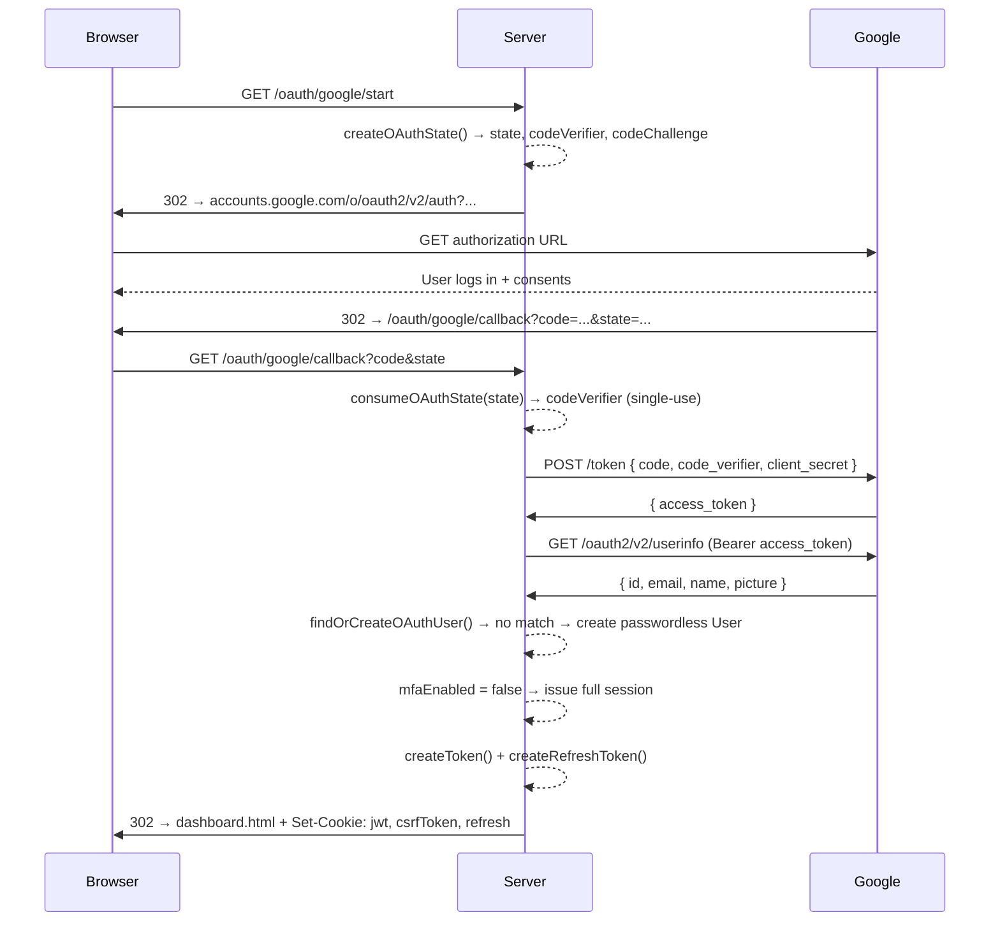
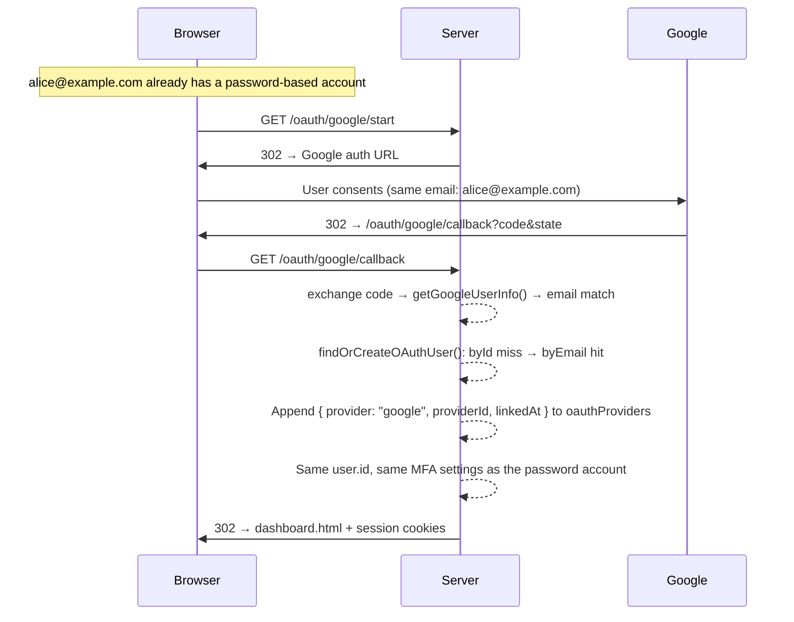
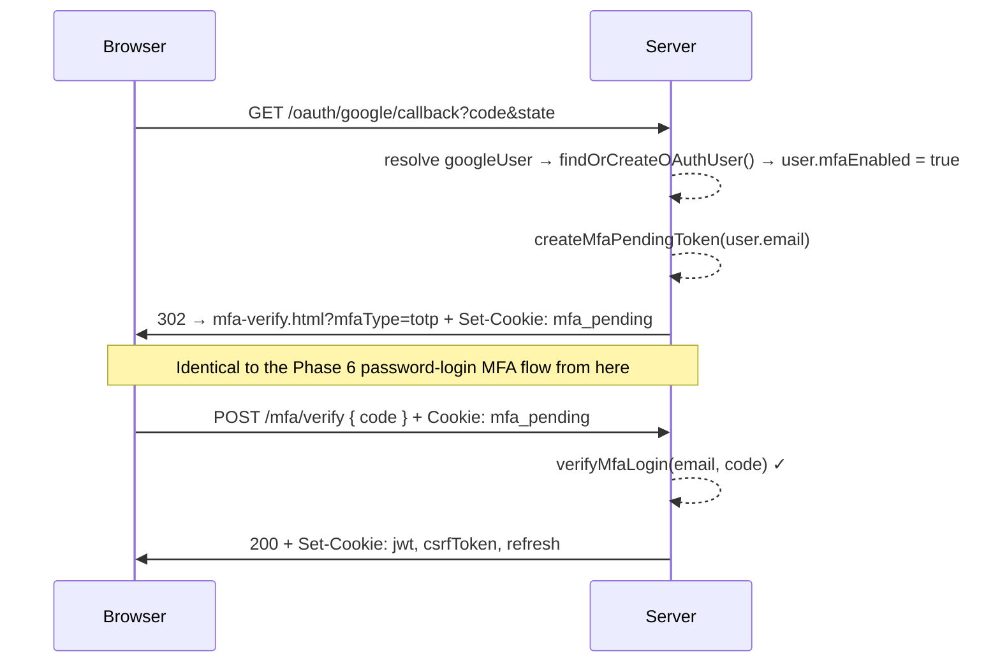

# Phase 7 — OAuth 2.0 Login (Google, with Account Linking)

## The Problem: Every Password Is a Liability You Chose to Own

In Phases 1–6 we built a complete password-based identity system: PBKDF2 hashing, JWT sessions, CSRF protection, refresh token rotation, and MFA. It's solid. But step back and look at what we're actually responsible for:

- We store a hash of every user's password. If our database ever leaks, that hash is now an attacker's problem to crack — and our reputation's problem regardless.
- We're responsible for password reset flows, password strength rules, and breach-notification if things go wrong.
- Most users reuse passwords across sites. A password stolen from some other, weaker site can be tried here (credential stuffing) — a risk that exists purely because we asked the user to invent and remember a secret in the first place.

None of this goes away by writing better code. It goes away by not holding the secret at all.

Google, Microsoft, GitHub, and similar providers already do identity verification at a scale and rigor most small apps can't match — they run fraud detection, enforce MFA, watch for leaked-credential reuse, and have entire teams dedicated to account security. **OAuth 2.0 lets us delegate the "prove who you are" problem to them**, and only ask for a signed statement of the result: "this user, verified, here's their email."

We still keep our own password-based login (Phases 1–6 are untouched) — OAuth is an *additional* door, not a replacement.

---

## The Mental Model: The Hotel Front Desk

Imagine checking into a hotel. You don't carry your passport into every room, hand it to every staff member, or leave it in your gym bag. Instead:

1. You show your passport **once**, at the front desk.
2. The front desk verifies it's really you, and hands you a **keycard** — not your passport, not a copy of it, just a token that proves *the front desk already checked*.
3. Every door in the hotel trusts the keycard. Housekeeping doesn't re-verify your passport; the gym doesn't either. They trust the front desk did its job.
4. If you lose the keycard, someone can get into your room — but they still can't get into your bank account, because the keycard only ever proved "this person checked in," nothing more.

This is exactly OAuth's shape:

- **Passport** = your Google password. You type it into Google's login page — never into our app.
- **Front desk** = Google's authorization server. It verifies you and decides what it's willing to vouch for.
- **Keycard** = the authorization code / access token we receive. It proves Google verified you, but by itself it's not your Google password, and it can't be used to change your Google account settings (we only asked for `openid email profile` — read-only identity, nothing else).
- **Our app** = the hotel room. We never see the passport. We just check the keycard is legitimate and let the guest in.

The key property: **our server never sees the user's Google password.** We only ever see a short-lived proof that Google already checked it.

---

## OAuth 2.0 Theory — The Authorization Code Flow, From First Principles

OAuth defines four roles. Mapping them onto this codebase:

| OAuth role | In this system |
|---|---|
| **Resource Owner** | The user — owns their Google identity |
| **Client** | Our backend (`Backend/src/`) — wants to know who the user is |
| **Authorization Server** | Google (`accounts.google.com`, `oauth2.googleapis.com`) — verifies the user, issues tokens |
| **Resource Server** | Google's userinfo API (`www.googleapis.com`) — returns the user's profile once we present a valid token |

There are several OAuth "flows" (grant types). We use the **Authorization Code flow**, the correct choice for a server that can keep a secret (our `GOOGLE_CLIENT_SECRET` never reaches the browser). Here's how it unfolds, step by step, tied to the real code:

### Step 1 — Kick off the flow: `GET /oauth/google/start`

```typescript
// oauth-route.ts
export function handleGoogleStart(_req: http.IncomingMessage, res: http.ServerResponse): void {
   const { state, codeChallenge } = createOAuthState();
   const authUrl = buildGoogleAuthUrl(state, codeChallenge);
   res.writeHead(302, { location: authUrl });
   res.end();
}
```

The user clicks "Login with Google" (a plain `<a>` tag in `login.html`, not a `fetch` call — this **must** be a real browser navigation, because Google's login page won't render inside an XHR response). Our server generates a `state` and a PKCE `codeChallenge`, builds Google's authorization URL, and redirects the browser there with a `302`.

```typescript
// oauth-service.ts
export function buildGoogleAuthUrl(state: string, codeChallenge: string): string {
    const params = new URLSearchParams({
        client_id: GOOGLE_CLIENT_ID,
        redirect_uri: REDIRECT_URL,
        response_type: "code",
        scope: "openid email profile",
        state,
        code_challenge: codeChallenge,
        code_challenge_method: "S256",
        prompt: "select_account",
    });
    return `https://accounts.google.com/o/oauth2/v2/auth?${params}`;
}
```

`response_type: "code"` is what selects the Authorization Code flow. `redirect_uri` tells Google exactly where to send the user back — Google will refuse to redirect anywhere else, which is itself a security control (it's registered in advance in the Google Cloud Console, so an attacker can't redirect the code somewhere else just by tampering with the URL).

### Step 2 — The user authenticates on Google's turf

The browser is now on `accounts.google.com`. The user logs in (or picks an already-logged-in account, because of `prompt: "select_account"`) and consents to sharing their `email`/`profile`. **Our server is not involved in this step at all** — we can't see the password, and we don't get a callback until Google is done.

### Step 3 — Google redirects back with a code: `GET /oauth/google/callback`

```typescript
// oauth-route.ts
export async function handleGoogleCallback(req, res): Promise<void> {
   const url = new URL(req.url!, `http://127.0.0.1:5000`);
   const code = url.searchParams.get("code");
   const state = url.searchParams.get("state");
   const error = url.searchParams.get("error");

   if (error || !code || !state) {
      res.writeHead(302, { Location: `${FRONTEND_URL}/login.html?error=oauth_denied` });
      res.end();
      return;
   }

   const codeVerifier = consumeOAuthState(state);
   if (!codeVerifier) {
      res.writeHead(302, { Location: `${FRONTEND_URL}/login.html?error=invalid_state` });
      res.end();
      return;
   }
   // ... exchange code, resolve user, issue session (see below)
}
```

Google appends `?code=...&state=...` to our redirect URI. The `code` is a short-lived, single-use authorization code — proof that the user consented — but it is **not** an access token yet.

### Step 4 — The `state` parameter: CSRF protection for the redirect

Without `state`, an attacker could start their *own* OAuth flow, get a valid `code` for *their own* Google account, and trick a victim's browser into visiting `/oauth/google/callback?code=<attacker's code>`. If the victim was logged out, this would log them into the attacker's account — a **login CSRF** attack, letting the attacker later see whatever the victim does under that shared identity.

`state` closes this: it's a random value we generate and remember *before* redirecting the user, and we refuse to complete the flow unless the value that comes back matches something we actually issued.

```typescript
// oauth-state.ts
const stateStore = new Map<string, OAuthState>();
const STATE_TTL_MS = 5 * 60 * 1000;

export function createOAuthState(): { state: string; codeChallenge: string } {
    const now = Date.now();
    for (const [key, val] of stateStore) {
        if (now - val.createdAt > STATE_TTL_MS) stateStore.delete(key);
    }

    const state = crypto.randomBytes(32).toString("base64url");
    const codeVerifier = crypto.randomBytes(32).toString("base64url");
    const codeChallenge = crypto.createHash("sha256").update(codeVerifier).digest("base64url");

    stateStore.set(state, { codeVerifier, createdAt: Date.now() });
    return { state, codeChallenge };
}

export function consumeOAuthState(state: string): string | null {
    const entry = stateStore.get(state);
    if (!entry) return null;
    if (Date.now() - entry.createdAt > STATE_TTL_MS) {
        stateStore.delete(state);
        return null;
    }
    stateStore.delete(state);
    return entry.codeVerifier;
}
```

Two properties make this robust: it **expires** (5 minutes — a `state` from an hour-old tab is rejected) and it's **single-use** (`consumeOAuthState` deletes the entry the moment it's read, so a captured callback URL can't be replayed). This is the same "unpredictable, server-remembered, single-use token" pattern as the CSRF double-submit cookie from Phase 3 — just applied to a redirect instead of a form submission.

Notice the `state` store doubles as the **PKCE verifier store** — each `state` is paired with the `codeVerifier` that was generated alongside it. That's the next piece.

### Step 5 — PKCE: why the authorization code alone isn't enough

PKCE (Proof Key for Code Exchange, RFC 7636) was designed for public clients (mobile apps, SPAs) that can't keep a secret — but we use it here too, as **defense in depth**, even though our backend can hold a real `client_secret`. Here's the attack it closes:

The authorization `code` travels through the browser's address bar and history, through redirect chains, potentially through browser extensions or referrer headers. If it were captured in transit, an attacker who obtains a stolen `code` could try to exchange it for a token themselves. Without PKCE, the only thing stopping them is the `client_secret` — but if that ever leaks (e.g. logged accidentally, checked into git), there's nothing else standing between a stolen code and a hijacked login.

PKCE adds a second binding between the `/start` request and the `/callback` request, independent of the secret:

1. At `/start`, we generate a random `codeVerifier` (32 random bytes) and derive a `codeChallenge = base64url(SHA256(codeVerifier))`. Only the **challenge** goes to Google; the **verifier** stays on our server, keyed by `state`.
2. Google remembers which challenge was associated with the `code` it issues.
3. At `/callback`, when we exchange the `code` for a token, we must also send the original `codeVerifier`. Google re-hashes it and checks it matches the challenge from step 1.

```typescript
// oauth-service.ts
export async function exchangeCodeForAccessToken(code: string, codeVerifier: string): Promise<string> {
    const body = new URLSearchParams({
        code,
        client_id: GOOGLE_CLIENT_ID,
        client_secret: GOOGLE_CLIENT_SECRET,
        redirect_uri: REDIRECT_URL,
        grant_type: "authorization_code",
        code_verifier: codeVerifier,
    }).toString();

    const raw = await httpsPost("oauth2.googleapis.com", "/token", body);
    const data = JSON.parse(raw);
    if (!data.access_token) throw new Error(`Token exchange failed: ${raw}`);
    return data.access_token as string;
}
```

Because SHA-256 is one-way, an attacker who only sees the `codeChallenge` (sent in the open, in the `/start` redirect URL) cannot derive the `codeVerifier` needed to complete the exchange. Stealing the `code` alone is now useless without also stealing our server's in-memory `codeVerifier` — which never leaves the backend process.

### Step 6 — Fetching identity

Once we have an `access_token`, we ask Google who it belongs to:

```typescript
// oauth-service.ts
export async function getGoogleUserInfo(accessToken: string): Promise<GoogleUser> {
    const raw = await httpsGet("www.googleapis.com", "/oauth2/v2/userinfo", accessToken);
    const data = JSON.parse(raw);
    if (!data.id || !data.email) throw new Error(`Invalid userinfo response: ${raw}`);
    return { id: data.id, email: data.email, name: data.name, picture: data.picture };
}
```

Note what's absent here: no OAuth client library, no `fetch`. Like every other phase in this project, the HTTPS calls to Google are built directly on Node's `https` module (`httpsPost`/`httpsGet` in `oauth-service.ts`), the same "no libraries" philosophy that gave us hand-rolled TOTP in Phase 6.

Also note: **the Google access token is used exactly once and then discarded.** We don't store it, and we never call Google again after this. All we keep is the resulting `id`/`email` — our own session (JWT + CSRF + refresh cookie) takes over from here, exactly as it would for a password login.

---

## Account Resolution — Finding or Creating the Local User

Once we know who Google says the user is, we need to map that to a row in `users.json`. This is the most interesting *design* decision in this phase — three possible outcomes:

```typescript
// oauth-service.ts
export async function findOrCreateOAuthUser(googleUser: GoogleUser): Promise<User> {
    const users = await readUsers();

    const byId = users.find((u) =>
        u.oauthProviders?.some((p) => p.provider === "google" && p.providerId === googleUser.id)
    );
    if (byId) return byId;

    const newProvider: OAuthProvider = {
        provider: "google",
        providerId: googleUser.id,
        linkedAt: new Date().toISOString(),
    };

    const byEmail = users.find((u) => u.email === googleUser.email.trim().toLocaleLowerCase());
    if (byEmail) {
        byEmail.oauthProviders = [...(byEmail.oauthProviders ?? []), newProvider];
        await writeUsers(users);
        return byEmail;
    }

    const newUser: User = {
        id: crypto.randomUUID(),
        email: googleUser.email.trim().toLocaleLowerCase(),
        oauthProviders: [newProvider],
    };
    users.push(newUser);
    await writeUsers(users);
    return newUser;
}
```

1. **Already linked** (`byId` match) — the fastest and safest path. We matched on Google's own stable `providerId`, not on email (emails can theoretically be reused/reassigned by a provider over time; a provider's internal user ID cannot). This is the path taken on every subsequent login.
2. **Email match, not yet linked** (`byEmail`) — this is **account linking**. A user who signed up in Phase 1 with `alice@example.com` + a password later clicks "Login with Google" using the same address. Because Google has already verified that `alice@example.com` belongs to whoever is sitting at the keyboard, we treat that as sufficient proof of ownership and attach a new `oauthProviders` entry to the *existing* account — same `id`, same MFA settings, same history. The user now has two ways in.
3. **No match at all** — a brand-new user. We create a `User` row with **no `password` field at all**. This is a passwordless account: the only way to log in is via Google, unless the user later sets a password through some other flow (not implemented in this phase).

This linking step is a deliberate trust decision, and it's important to be honest about its assumption: **we trust that Google will only report an email address it has verified.** If that assumption were ever false, email-based linking would let someone hijack a local account by registering an OAuth identity with a spoofed, unverified address. See *Known Limitations* below — this codebase doesn't currently double-check the `email_verified` field Google's userinfo response includes.

---

## Passwordless Accounts Need a New Login Guard

`User.password` is now optional (`Backend/src/types/auth-types.ts`):

```typescript
export interface User {
   id: string;
   email: string;
   password?: string;
   mfaEnabled?: boolean;
   totpSecret?: string;
   recoveryCodes?: string[];
   emailOtpEnabled?: boolean;
   oauthProviders?: OAuthProvider[];
}
```

Before this phase, every `User` was guaranteed to have a `password` hash, so `loginUser` could go straight to `verifyPassword`. Now a Google-only user has `password: undefined`. If we let that fall through to `verifyPassword(password, undefined)`, we'd either crash or produce a confusing "Invalid credentials" for a user who never set a password in the first place. So `auth-service.ts` special-cases it:

```typescript
// auth-service.ts — loginUser()
if (!user.password) {
   return {
      statusCode: 400,
      statusMsg: "This account uses Google sign-in. Please click 'Login with Google'.",
   };
}
```

This is a small thing, but it's the kind of edge case that only appears once you actually let two authentication methods coexist on the same user model — and it's a good example of why "just add a new field" isn't free; every place that assumed the old shape has to be re-audited.

---

## Interaction with MFA (Phase 6): One Gate, Regardless of Entry Point

MFA shouldn't be something an attacker can route around just by choosing a different login method. `handleGoogleCallback` reuses the *exact* `mfa_pending` mechanism from Phase 6 — it doesn't reimplement MFA, it just calls into the same primitives:

```typescript
// oauth-route.ts — inside handleGoogleCallback
const user = await findOrCreateOAuthUser(googleUser);

if (user.mfaEnabled || user.emailOtpEnabled) {
   let mfaPendingToken: string;
   let mfaType: string;
   if (user.emailOtpEnabled) {
      await generateAndSendEmailOtp(user.email);
      mfaPendingToken = createMfaPendingToken(user.email);
      mfaType = "email-otp";
   } else {
      mfaPendingToken = createMfaPendingToken(user.email);
      mfaType = "totp";
   }
   res.setHeader("Set-Cookie", [buildMfaPendingCookie(mfaPendingToken)]);
   res.writeHead(302, { Location: `${FRONTEND_URL}/mfa-verify.html?mfaType=${mfaType}` });
   res.end();
} else {
   const csrfToken = crypto.randomBytes(32).toString("hex");
   const jwt = createToken(user.email, csrfToken);
   const refreshToken = await createRefreshToken(user.email);

   res.writeHead(302, {
      Location: `${FRONTEND_URL}/dashboard.html`,
      "Set-Cookie": [buildJwtCookie(jwt), buildCsrfCookie(csrfToken), buildRefreshCookie(refreshToken)],
   });
   res.end();
}
```

Whether a user typed a password or clicked "Login with Google," they land in the exact same place: `mfaEnabled`/`emailOtpEnabled` gate them into the Phase 6 state machine (`unauthenticated → password_verified/oauth_verified (pending) → fully_authenticated`) before a full session is issued. `createMfaPendingToken`, `buildMfaPendingCookie`, `createToken`, and `createRefreshToken` are unmodified — this phase adds a *second on-ramp* into the existing pipeline, not a parallel one.

---

## Architecture Overview

### New user — first-time Google sign-in



### Existing password user — linking a Google account



### Google sign-in for a user with MFA enabled



---

## Key Concepts Learned

### 1. Delegated Authentication vs. Authentication We Own

Every prior phase was about doing authentication *ourselves*, correctly. OAuth is the opposite move: recognizing that a specialized third party can do the "verify this human" step better than we can, and limiting our job to trusting a signed statement of their result. We still own the *session* (JWT, CSRF, refresh tokens, MFA) — those don't change. What changes is only how the very first "who is this" question gets answered.

### 2. `state` — CSRF for Redirect-Based Flows

Phase 3 taught CSRF protection for form submissions (double-submit cookie). OAuth's redirect dance has the same vulnerability shape — a request that changes account state (logging in) triggered by a link the user didn't fully control — and the same fix: an unpredictable, server-issued, single-use, time-bound token that must round-trip before we honor the request.

### 3. PKCE — A Second Secret That Never Touches the Wire in the Open

```
codeVerifier = random(32 bytes)                     # never sent to Google in /start
codeChallenge = base64url(SHA256(codeVerifier))      # sent in /start (public)
# ... later, at /token exchange:
send codeVerifier → Google recomputes SHA256(codeVerifier) → must equal codeChallenge
```

The one-wayness of SHA-256 is what makes this work: observing `codeChallenge` in a browser history or a referrer log gives an attacker no way to compute `codeVerifier`. This mirrors the same building block Phase 6 used for recovery codes (hash now, compare later, never store the reversible form) — just applied to a handshake secret instead of a stored credential.

### 4. Why Token Exchange Must Happen Server-to-Server

The `/token` request includes `GOOGLE_CLIENT_SECRET`. If that request were made from the browser (e.g. via client-side JavaScript), the secret would be visible in DevTools network logs to anyone with access to that machine, and effectively public. Our backend makes this call itself, over a direct HTTPS connection to `oauth2.googleapis.com`, so the secret never crosses into anything the browser can inspect.

### 5. Account Linking Trust Model

```typescript
const byEmail = users.find((u) => u.email === googleUser.email.trim().toLocaleLowerCase());
```

This single line encodes a policy decision: *"a verified email address from Google is sufficient proof of ownership of the local account with that same email."* It's a reasonable default and what most consumer apps do — but it's worth naming explicitly, because it means the security of local account linking is only as strong as Google's guarantee that the email it hands back is actually verified and controlled by the user (see *Known Limitations*).

### 6. Raw `https`, No SDK

```typescript
function httpsPost(hostname: string, path: string, body: string): Promise<string> { /* ... */ }
function httpsGet(hostname: string, path: string, accessToken: string): Promise<string> { /* ... */ }
```

Consistent with the rest of this project (hand-rolled TOTP instead of `otplib`, hand-rolled JWTs instead of `jsonwebtoken`), the Google API calls are built directly on Node's `https` module rather than an OAuth client library or `fetch`. This makes every step of the protocol — the exact bytes sent to `/token`, the exact header sent to `/userinfo` — visible and inspectable rather than hidden behind an abstraction.

---

## What Changed from Phase 6

| Component | Phase 6 | Phase 7 (+ OAuth) |
|---|---|---|
| **Login methods** | Password only | Password **or** Google OAuth |
| **`User.password`** | Always present | Optional — absent for OAuth-only accounts |
| **`User` fields** | `{ id, email, passwordHash, salt, mfaEnabled, totpSecret, recoveryCodes, emailOtpEnabled }` | + `oauthProviders?: OAuthProvider[]` |
| **New endpoints** | — | `GET /oauth/google/start`, `GET /oauth/google/callback` |
| **`loginUser()`** | Verify password, else 401 | Detects passwordless accounts → 400 with a Google-sign-in hint |
| **Login page** | Email/password form only | + "Login with Google" link, OAuth error banner (`oauth_denied`, `invalid_state`, `oauth_failed`) |
| **MFA gate** | Reached only via password login | Reached via password login **or** OAuth callback — same `mfa_pending` mechanism either way |

**Files added:**
- `Backend/src/services/oauth-service.ts` — Google auth URL builder, PKCE, raw HTTPS token exchange, userinfo fetch, `findOrCreateOAuthUser()`
- `Backend/src/routers/oauth-route.ts` — `handleGoogleStart`, `handleGoogleCallback`
- `Backend/src/utils/oauth-state.ts` — `state` + PKCE `codeVerifier` store (TTL, single-use)

**Files modified:**
- `Backend/src/server.ts` — registers `/oauth/google/start` and `/oauth/google/callback`
- `Backend/src/types/auth-types.ts` — `OAuthProvider` interface added; `User.password` made optional; `User.oauthProviders?` added
- `Backend/src/services/auth-service.ts` — `loginUser()` returns a dedicated 400 for accounts with no password
- `Frontend/public/login.html` — "Login with Google" link + OAuth error message element
- `Frontend/src/login.ts` — reads `?error=` query param, renders a matching message

---

## Security Measures Implemented

| Measure | Where | What It Prevents |
|---|---|---|
| `state` parameter, random 32 bytes | `oauth-state.ts` | Login CSRF via a crafted callback URL |
| `state` single-use (deleted on read) | `oauth-state.ts` | Replaying a captured callback URL |
| `state` 5-minute TTL | `oauth-state.ts` | An old, possibly-leaked `state`/`codeVerifier` pair being usable indefinitely |
| PKCE (`S256` code challenge/verifier) | `oauth-service.ts` | Authorization code interception/replay by a party that doesn't hold the verifier |
| Token exchange happens server-to-server | `oauth-service.ts` | `GOOGLE_CLIENT_SECRET` ever reaching the browser |
| Google access token used once, never persisted | `oauth-service.ts` | A stored Google token becoming a long-lived attack target if the DB leaks |
| Account matched by `providerId` before email | `oauth-service.ts` | Relying solely on a mutable field (email) to identify a returning OAuth user |
| Passwordless accounts rejected cleanly in `loginUser` | `auth-service.ts` | Confusing failure states / accidental null-password comparisons |
| MFA gate reused unchanged for OAuth logins | `oauth-route.ts` | Using Google sign-in as a bypass around a user's configured MFA |

---

## File Reference

| File | Phase 7 Role |
|---|---|
| `Backend/src/services/oauth-service.ts` | `buildGoogleAuthUrl()`, `exchangeCodeForAccessToken()`, `getGoogleUserInfo()`, `findOrCreateOAuthUser()`, raw `https` helpers |
| `Backend/src/routers/oauth-route.ts` | `handleGoogleStart()`, `handleGoogleCallback()` — orchestrates the full redirect flow and hands off into session/MFA issuance |
| `Backend/src/utils/oauth-state.ts` | `createOAuthState()`, `consumeOAuthState()` — CSRF `state` + PKCE `codeVerifier` storage |
| `Backend/src/types/auth-types.ts` | `OAuthProvider` interface; `User.password` optional; `User.oauthProviders?` |
| `Backend/src/services/auth-service.ts` | `loginUser()` — passwordless-account guard |
| `Backend/src/server.ts` | Routes `/oauth/google/start`, `/oauth/google/callback` |
| `Frontend/public/login.html` | "Login with Google" link, OAuth error banner |
| `Frontend/src/login.ts` | Reads `?error=` from the redirect back from `/oauth/google/callback` and displays it |

---

## Known Limitations (Addressed in Later Phases)

- **In-memory `state`/PKCE store** — `oauth-state.ts` uses a plain `Map`. A server restart mid-flow invalidates any in-progress login (same caveat as the JWT secret from Phase 4), and this won't work across multiple server processes/instances without a shared store (Redis, a database table).
- **Hardcoded URLs** — `REDIRECT_URL` (`http://127.0.0.1:5000/oauth/google/callback`) and `FRONTEND_URL` (`http://127.0.0.1:5500/Frontend/public`) are hardcoded constants, not environment-driven. Fine for local development; a production deployment needs these to come from config per environment.
- **`email_verified` not checked** — `getGoogleUserInfo()` reads `id`/`email`/`name`/`picture` but never inspects Google's `email_verified` field before using the email to link accounts. In practice Google only returns verified emails for this scope, but the code doesn't defensively assert it.
- **Single provider** — only Google is implemented. There's no provider-agnostic abstraction yet (e.g. a common interface `getUserInfo(provider, token)`), so adding GitHub or another provider today would mean duplicating most of `oauth-service.ts`.
- **No unlinking endpoint** — once a Google account is linked (or a user is created OAuth-only), there's no API to remove `oauthProviders` entries or attach a password to a passwordless account. A user who loses access to their Google account has no self-service recovery path.
- **No rate limiting on `/oauth/google/start`** — an attacker could spam this endpoint to grow the `state` map, though the 5-minute TTL sweep in `createOAuthState()` bounds the damage.

Do you want to go deeper on any part of this?
